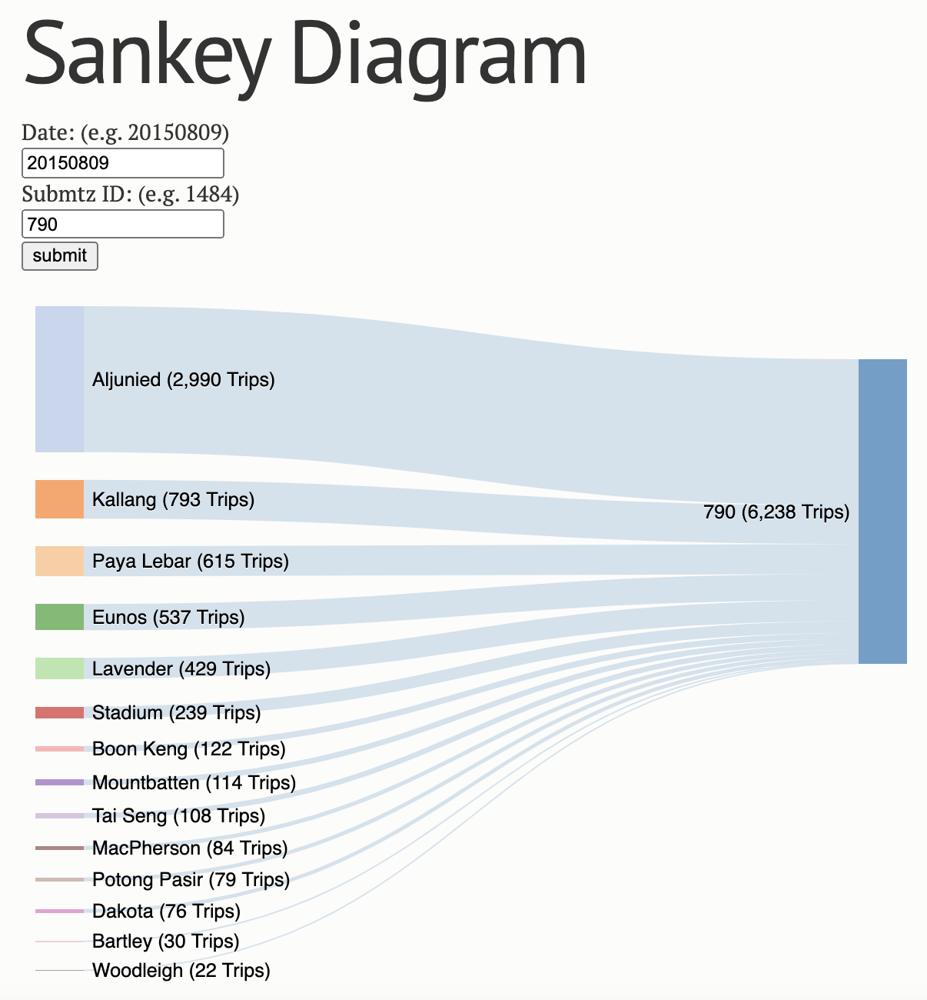

# flask-jsSankey
Sankey Chart using d3.js and Flask.

The data source is a static CSV file: no header; each line in the format of _source, target, weight_

## To run:

1. Make sure you have flask installed
2. `python app.py`

Now navigate your browser to http://localhost:5000 to see.

3. To run the app on a server address, change the host parameter in `app.run(host='0.0.0.0')`

